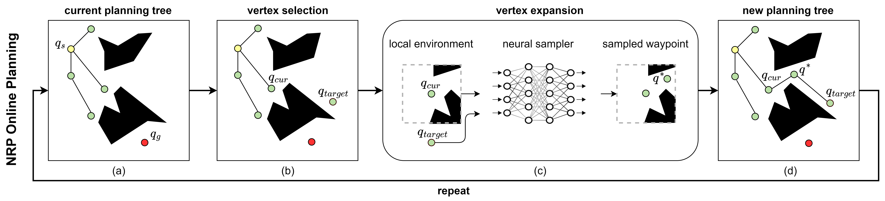

# NRP


NRP is neural motion planner which excels at generating whole-body motion for mobile manipulator in household environments
by learning local sampling distributions.

## Introduction



**Authors**: [Yunfan Lu](https://lyfkyle.github.io/)\*, [Yuchen Ma](https://github.com/Ruilin-W)\*, [Panpan Cai](https://cindycia.github.io/), [David Hsu](https://www.comp.nus.edu.sg/~dyhsu/)

**Institutions**: [Adacomp Lab, National University of Singapore](https://adacomp.comp.nus.edu.sg/)

**Video**: [YouTube](https://www.youtube.com/watch?v=iwGLnul00bo)

**Paper**: [Neural Randomized Planning for Whole Body Robot Motion](https://arxiv.org/abs/2405.11317).

```
@article{lu2024neural,
  title={Neural randomized planning for whole body robot motion},
  author={Lu, Yunfan and Ma, Yuchen and Hsu, David and Cai, Panpan},
  journal={arXiv preprint arXiv:2405.11317},
  year={2024}
}
```

If you find this work useful or interesting, please kindly give us a star ⭐, thanks!😀

# Installation

Install system dependencies first.

```
sudo apt-get install libboost-all-dev
```

Download prebuild python wheel for OMPL

```
wget https://github.com/ompl/ompl/releases/download/prerelease/ompl-1.6.0-cp310-cp310-manylinux_2_28_x86_64.whl
pip install ompl-1.6.0-cp310-cp310-manylinux_2_28_x86_64.whl
```

Create conda environment with python 3.8

```bash
conda install pytorch torchvision pytorch-cuda -c pytorch -c nvidia
conda install pytorch3d -c pytorch3d
pip install -r requirements.txt
```

## Download pre-built ompl binary

```

```

## Download models

# Run experiments

## Test on a single problem

## Run experiment
