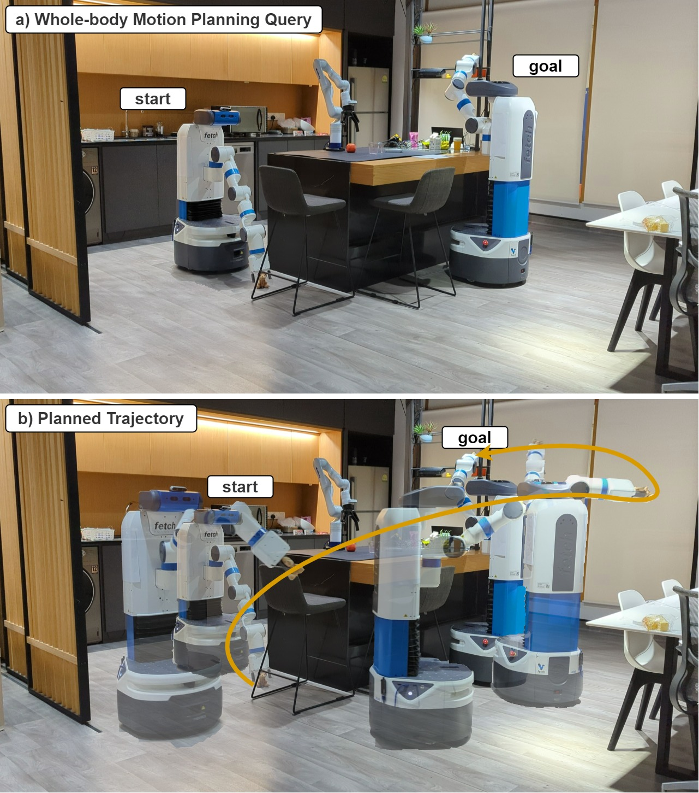
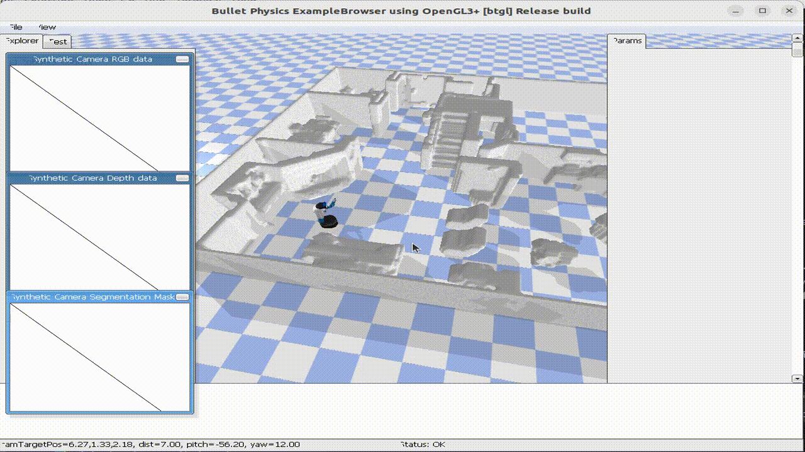

# Neural Randomized Planner (NRP) for Whole Body Robot Motion



## Introduction

NRP is neural motion planner which excels at generating whole-body motion for mobile manipulator in household environments by learning local sampling distributions.


**Authors**: [Yunfan Lu](https://lyfkyle.github.io/)\*, [Yuchen Ma](https://kevinskwk.github.io/)\*, [David Hsu](https://www.comp.nus.edu.sg/~dyhsu/), [Panpan Cai](https://cindycia.github.io/),

**Institutions**: [Adacomp Lab, National University of Singapore](https://adacomp.comp.nus.edu.sg/)

**Video**: [YouTube](https://www.youtube.com/watch?v=iwGLnul00bo)

**Paper**: [Neural Randomized Planning for Whole Body Robot Motion](https://arxiv.org/abs/2405.11317).

```
@article{lu2024neural,
  title={Neural randomized planning for whole body robot motion},
  author={Lu, Yunfan and Ma, Yuchen and Hsu, David and Cai, Panpan},
  journal={arXiv preprint arXiv:2405.11317},
  year={2024}
}
```

If you find this work useful or interesting, please kindly give us a star ⭐, thanks!😀

## Installation

Install system dependencies first.

```bash
sudo apt-get install libboost-all-dev
```

Download prebuild python wheel for OMPL

```bash
wget https://github.com/ompl/ompl/releases/download/prerelease/ompl-1.6.0-cp310-cp310-manylinux_2_28_x86_64.whl
pip install ompl-1.6.0-cp310-cp310-manylinux_2_28_x86_64.whl
```

Create conda environment and install project dependencies.

```bash
conda install pytorch==2.4.0 torchvision pytorch-cuda -c pytorch -c nvidia
pip install -r requirements.txt
```

Download model and datasets

```python
python download_dataset_and_model.py
```

## Run experiments

All scripts are in nrp/test folder

## Test on a single problem

To test on a single problem, run the following

```python
cd nrp/test
python test_planning_performance.py --planner nrp_g --env fetch_11d --env_idx 0
```

This will run the selected planner on a selected query. The planning will take maximum 10 seconds. If the planning is successful, the result will be visualized in the Pybullet simulator as well as stored in the `results` folder.



- Currently only "fetch_11d" environment is supported.

- There are 250 pre-generated motion planning queries in the dataset. Change env_idx to select any one of them

- We support the following non-optimal planner ["nrp_g", "nrp_d", "rrt", "rrt_is", "cvae", "fire"] and the following optimal planner ["nrp_g_star", "nrp_d_star", "rrt_star", "bit_star", "cvae_star", "fire_star"]

## Run experiment

To repeat the experiment reported in paper, run the following scripts

```python
cd nrp/test
python test_planning_performance_time.py --planner nrp_g
```

This will run the planner on all 250 environments for a total of 10 times and report the aggregated results.
